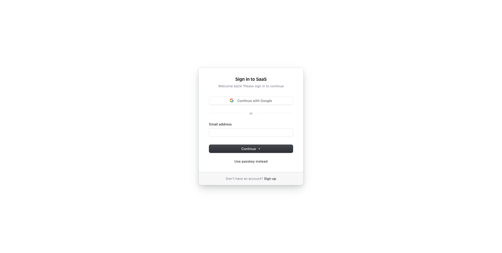

# Boilerplate and Starter for Next.js 16+, Tailwind CSS 4, and TypeScript.

<p align="center">
  <a href="https://demo.nextjs-boilerplate.com">
    
  </a>
</p>

🚀 Boilerplate and Starter for Next.js with App Router, Tailwind CSS, and TypeScript ⚡️ Prioritizing developer experience first: Next.js, TypeScript, ESLint, Prettier, Lefthook (replacing Husky), Lint-Staged, Vitest (replacing Jest), Testing Library, Playwright, Commitlint, VSCode, Tailwind CSS, Authentication with [Clerk](https://clerk.com?utm_source=github&utm_medium=sponsorship&utm_campaign=nextjs-boilerplate), Monitoring as Code, Storybook, Multi-language (i18n), Secure with [Arcjet](https://launch.arcjet.com/Q6eLbRE) (Bot detection, Rate limiting, Attack protection, etc.), and more.

Clone this project and use it to create your own Next.js project. You can check out the live demo at [Next.js Boilerplate](https://demo.nextjs-boilerplate.com), which includes a working authentication system.

## Sponsors

<table width="100%">
  <tr height="187px">
    <td align="center" width="33%">
      <a href="https://clerk.com?utm_source=github&utm_medium=sponsorship&utm_campaign=nextjs-boilerplate">
        <picture>
          <source media="(prefers-color-scheme: dark)" srcset="https://github.com/ixartz/SaaS-Boilerplate/assets/1328388/6fb61971-3bf1-4580-98a0-10bd3f1040a2">
          <source media="(prefers-color-scheme: light)" srcset="https://github.com/ixartz/SaaS-Boilerplate/assets/1328388/f80a8bb5-66da-4772-ad36-5fabc5b02c60">
          
        </picture>
      </a>
    </td>
  </tr>
  <tr height="187px">
    <td align="center" width="33%">
      <a href="https://launch.arcjet.com/Q6eLbRE">
        <picture>
          <source media="(prefers-color-scheme: dark)" srcset="public/assets/images/arcjet-dark.svg?raw=true">
          <source media="(prefers-color-scheme: light)" srcset="public/assets/images/arcjet-light.svg?raw=true">
          
        </picture>
      </a>
    </td>
    <td align="center" width="33%">
      <a href="https://l.crowdin.com/next-js">
        <picture>
          <source media="(prefers-color-scheme: dark)" srcset="public/assets/images/crowdin-white.png?raw=true">
          <source media="(prefers-color-scheme: light)" srcset="public/assets/images/crowdin-dark.png?raw=true">
          
        </picture>
      </a>
    </td>
  </tr>
  <tr height="187px">
    <td align="center" width="33%">
      <a href="https://posthog.com/?utm_source=github&utm_medium=sponsorship&utm_campaign=next-js-boilerplate">
        <picture>
          <source media="(prefers-color-scheme: dark)" srcset="https://posthog.com/brand/posthog-logo-white.svg">
          <source media="(prefers-color-scheme: light)" srcset="https://posthog.com/brand/posthog-logo.svg">
          
        </picture>
      </a>
    </td>
    <td align="center" width="33%">
      <a href="https://www.rapidproxy.io/?ref=ixartz">
        
      </a>
    </td>
    <td align="center" style=width="33%">
      <a href="https://nextjs-boilerplate.com/pro-saas-starter-kit">
        
      </a>
    </td>
  </tr>
  <tr height="187px">
    <td align="center" width="33%">
      <a href="mailto:contact@nextjs-boilerplate.com">
        Add your logo here
      </a>
    </td>
  </tr>
</table>

### Demo

**Live demo: [Next.js Boilerplate](https://demo.nextjs-boilerplate.com)**

| Sign Up | Sign In |
| --- | --- |
| [](https://demo.nextjs-boilerplate.com/sign-up) | [](https://demo.nextjs-boilerplate.com/sign-in) |

### Features

Developer experience first, extremely flexible code structure and only keep what you need:

- ⚡ [Next.js](https://nextjs.org) with App Router support
- 🔥 Type checking [TypeScript](https://www.typescriptlang.org)
- 💎 Integrate with [Tailwind CSS](https://tailwindcss.com)
- 🤖 AI coding agent instructions for Claude Code, Codex, Cursor, OpenCode, Copilot, and more
- ✅ Strict Mode for TypeScript and React 19
- 🔒 Authentication with [Clerk](https://clerk.com?utm_source=github&utm_medium=sponsorship&utm_campaign=nextjs-boilerplate): Sign up, Sign in, Sign out, Forgot password, Reset password, and more.
- 👤 Passwordless Authentication with Magic Links, Multi-Factor Auth (MFA), Social Auth (Google, Facebook, Twitter, GitHub, Apple, and more), Passwordless login with Passkeys, User Impersonation
- 🌐 Multi-language (i18n) with next-intl and [Crowdin](https://l.crowdin.com/next-js)
- ♻️ Type-safe environment variables with T3 Env
- 🔴 Validation library with Zod
- 📏 Linter with Oxlint with Ultracite preset (replacing ESLint)
- 💖 Code Formatter with Oxfmt (replacing Prettier)
- 🦊 Husky for Git Hooks (replaced by Lefthook)
- 🚫 Lint-staged for running linters on Git staged files
- 🚓 Lint git commit with Commitlint
- 📓 Write standard compliant commit messages with Commitizen
- 🔍 Unused files and dependencies detection with Knip
- 🌍 I18n validation and missing translation detection with i18n-check
- 🦺 Unit Testing with Vitest and Browser mode (replacing React Testing Library)
- 🧪 Integration and E2E Testing with Playwright
- 👷 Run tests on pull request with GitHub Actions
- 🎉 Storybook for UI development
- ☂️ Code coverage with Codecov
- 🖥️ Monitoring as Code with [Checkly](https://www.checklyhq.com/?utm_source=github&utm_medium=sponsorship&utm_campaign=next-js-boilerplate)
- 🔐 Security and bot protection ([Arcjet](https://launch.arcjet.com/Q6eLbRE))
- 📊 Analytics with PostHog
- 🎁 Automatic changelog generation with Semantic Release
- 🔍 Visual regression testing
- 💡 Absolute Imports using `@` prefix
- 🗂 VSCode configuration: Debug, Settings, Tasks and Extensions
- 🤖 SEO metadata, JSON-LD and Open Graph tags
- 🗺️ Sitemap.xml and robots.txt
- 👷 Automatic dependency updates with Dependabot
- ⚙️ Bundler Analyzer
- 🌈 Include a FREE minimalist theme
- 💯 Maximize lighthouse score

Built-in features from Next.js:

- ☕ Minify HTML & CSS
- 💨 Live reload
- ✅ Cache busting

Optional features (easy to add):

- 🔑 Multi-tenancy, Role-based access control (RBAC)
- 🔐 OAuth for Single Sign-On (SSO), Enterprise SSO, SAML, OpenID Connect (OIDC), EASIE
- 🔗 Web 3 (Base, MetaMask, Coinbase Wallet, OKX Wallet)

### Philosophy

- Nothing is hidden from you, allowing you to make any necessary adjustments to suit your requirements and preferences.
- Dependencies are regularly updated on a monthly basis
- Start for free without upfront costs
- Easy to customize
- Minimal code
- Unstyled template
- SEO-friendly
- 🚀 Production-ready

### Requirements

- Node.js 24+ and npm

### Getting started

Run the following command on your local environment:

```shell
git clone --depth=1 https://github.com/ixartz/Next-js-Boilerplate.git my-project-name
cd my-project-name
npm install
```

For your information, all dependencies are updated every month.

Then, you can run the project locally in development mode with live reload by executing:

```shell
npm run dev
```

Open http://localhost:3000 with your favorite browser to see your project.

Need advanced features? Multi-tenancy & Teams, Roles & Permissions, Shadcn UI, End-to-End Typesafety with oRPC, Stripe Payment, Light / Dark mode. Try [Next.js Boilerplate Pro](https://nextjs-boilerplate.com/pro-saas-starter-kit).

Or, need a Self-hosted auth stack (Better Auth)? Try [Next.js Boilerplate Plus](https://nextjs-boilerplate.com/nextjs-saas-starter-kit)

### Set up authentication

To get started, create a Clerk account at [Clerk.com](https://clerk.com?utm_source=github&utm_medium=sponsorship&utm_campaign=nextjs-boilerplate) and create a new application in the Clerk Dashboard. Then copy the `NEXT_PUBLIC_CLERK_PUBLISHABLE_KEY` and `CLERK_SECRET_KEY` values and add them to your `.env.local` file (not tracked by Git):

```shell
NEXT_PUBLIC_CLERK_PUBLISHABLE_KEY=your_clerk_pub_key
CLERK_SECRET_KEY=your_clerk_secret_key
```

You now have a fully functional authentication system with Next.js, including features such as sign up, sign in, sign out, forgot password, reset password, update profile, update password, update email, delete account, and more.

### Translation (i18n) setup

For translation, the project uses `next-intl` combined with [Crowdin](https://l.crowdin.com/next-js). As a developer, you only need to take care of the English (or another default language) version. Translations for other languages are automatically generated and handled by Crowdin. You can use Crowdin to collaborate with your translation team or translate the messages yourself with the help of machine translation.

To set up translation (i18n), create an account at [Crowdin.com](https://l.crowdin.com/next-js) and create a new project. In the newly created project, you will be able to find the project ID. You will also need to create a new Personal Access Token by going to Account Settings > API. Then, in your GitHub Actions, you need to define the following environment variables: `CROWDIN_PROJECT_ID` and `CROWDIN_PERSONAL_TOKEN`.

After defining the environment variables in your GitHub Actions, your localization files will be synchronized with Crowdin every time you push a new commit to the `main` branch.

### Project structure

```shell
.
├── README.md                       # README file
├── .github                         # GitHub folder
│   ├── actions                     # Reusable actions
│   └── workflows                   # GitHub Actions workflows
├── .storybook                      # Storybook folder
├── .vscode                         # VSCode configuration
├── public                          # Public assets folder
├── src
│   ├── app                         # Next JS App (App Router)
│   ├── components                  # React components
│   ├── libs                        # 3rd party libraries configuration
│   ├── locales                     # Locales folder (i18n messages)
│   ├── styles                      # Styles folder
│   ├── templates                   # Templates folder
│   ├── types                       # Type definitions
│   ├── utils                       # Utilities folder
│   └── validations                 # Validation schemas
├── tests
│   ├── e2e                         # E2E tests, also includes Monitoring as Code
│   └── integration                 # Integration tests
├── eslint.config.mjs               # ESLint configuration
├── next.config.ts                  # Next JS configuration
├── package.json                    # NPM dependencies and scripts
├── playwright.config.ts            # Playwright configuration
├── tsconfig.json                   # TypeScript configuration
└── vitest.config.ts                # Vitest configuration
```

### Customization

You can easily configure Next js Boilerplate by searching the entire project for `FIXME:` to make quick customizations. Here are some of the most important files to customize:

- `public/apple-touch-icon.png`, `public/favicon.ico`, `public/favicon-16x16.png` and `public/favicon-32x32.png`: your website favicon
- `src/utils/AppConfig.ts`: configuration file
- `src/templates/BaseTemplate.tsx`: default theme
- `next.config.ts`: Next.js configuration
- `.env`: default environment variables

You have full access to the source code for further customization. The provided code is just an example to help you start your project. The sky's the limit 🚀.

### Commit Message Format

The project follows the [Conventional Commits](https://www.conventionalcommits.org/) specification, meaning all commit messages must be formatted accordingly. To help you write commit messages, the project provides an interactive CLI that guides you through the commit process. To use it, run the following command:

```shell
npm run commit
```

One of the benefits of using Conventional Commits is the ability to automatically generate GitHub releases. It also allows us to automatically determine the next version number based on the types of commits that are included in a release.

#### Commit Types

Every commit message follows Conventional Commits and must begin with a type prefix (e.g., `feat: add login page`). The table below lists the available types:

| Type | Description |
| --- | --- |
| `feat` | New feature or functionality |
| `fix` | Bug fix |
| `docs` | Documentation only |
| `style` | Code formatting without logic changes |
| `refactor` | Code restructuring without behavior changes |
| `perf` | Performance improvement |
| `test` | Adding or updating tests |
| `build` | Build system |
| `ci` | CI configuration and scripts |
| `chore` | Maintenance tasks (dependencies, config) |
| `revert` | Reverts a previous commit |

### Testing

All unit tests are located alongside the source code in the same directory, making them easier to find. The unit test files follow this format: `*.test.ts` or `*.test.tsx`. The project uses Vitest and React Testing Library for unit testing. You can run the tests with the following command:

```shell
npm run test
```

### Integration & E2E Testing

The project uses Playwright for integration and end-to-end (E2E) testing. Integration test files use the `*.integ.ts` extension, while E2E test files use the `*.e2e.ts` extension. You can run the tests with the following commands:

```shell
npx playwright install # Only for the first time in a new environment
npm run test:e2e
```

### Storybook

Storybook is configured for UI component development and testing. The project uses Storybook with Next.js and Vite integration, including accessibility testing and documentation features.

Stories are located alongside your components in the `src` directory and follow the pattern `*.stories.ts` or `*.stories.tsx`.

You can run Storybook in development mode with:

```shell
npm run storybook
```

This will start Storybook on http://localhost:6006 where you can view and interact with your UI components in isolation.

To run Storybook tests in headless mode, you can use the following command:

```shell
npm run storybook:test
```

### Local Production Build

Generate an optimized production build locally:

```shell
npm run build-local
```

This command builds the Next.js app for production. It doesn't start the server; use `npm run start` to run the build locally.

### Deploy to production

You can generate a production build with:

```shell
$ npm run build
```

It generates an optimized production build of the boilerplate. To test the generated build, run:

```shell
$ npm run start
```

You also need to defined the environment variables `CLERK_SECRET_KEY` using your own key.

This command starts a local server using the production build. You can now open http://localhost:3000 in your preferred browser to see the result.

### Code coverage

Next.js Boilerplate relies on [Codecov](https://about.codecov.io/codecov-free-trial/?utm_source=github&utm_medium=paid-community&utm_campaign=general-fy25q1-nextjs&utm_content=github-banner-nextjsboilerplate-logo) for code coverage reporting solution. To enable Codecov, create a Codecov account and connect it to your GitHub account. Your repositories should appear on your Codecov dashboard. Select the desired repository and copy the token. In GitHub Actions, define the `CODECOV_TOKEN` environment variable and paste the token.

Make sure to create `CODECOV_TOKEN` as a GitHub Actions secret, do not paste it directly into your source code.

### Checkly monitoring

The project uses [Checkly](https://www.checklyhq.com/?utm_source=github&utm_medium=sponsorship&utm_campaign=next-js-boilerplate) to ensure that your production environment is always up and running. At regular intervals, Checkly runs the tests ending with `*.check.e2e.ts` extension and notifies you if any of the tests fail. Additionally, you have the flexibility to execute tests from multiple locations to ensure that your application is available worldwide.

To use Checkly, you must first create an account on [their website](https://www.checklyhq.com/?utm_source=github&utm_medium=sponsorship&utm_campaign=next-js-boilerplate). After creating an account, generate a new API key in the Checkly Dashboard and set the `CHECKLY_API_KEY` environment variable in GitHub Actions. Additionally, you will need to define the `CHECKLY_ACCOUNT_ID`, which can also be found in your Checkly Dashboard under User Settings > General.

To complete the setup, update the `checkly.config.ts` file with your own email address and production URL.

### Arcjet security and bot protection

The project uses [Arcjet](https://launch.arcjet.com/Q6eLbRE), a security as code product that includes several features that can be used individually or combined to provide defense in depth for your site.

To set up Arcjet, [create a free account](https://launch.arcjet.com/Q6eLbRE) and get your API key. Then add it to the `ARCJET_KEY` environment variable.

Arcjet is configured with two main features: bot detection and the Arcjet Shield WAF:

- [Bot detection](https://docs.arcjet.com/bot-protection/concepts) is configured to allow search engines, preview link generators e.g. Slack and Twitter previews, and to allow common uptime monitoring services. All other bots, such as scrapers and AI crawlers, will be blocked. You can [configure additional bot types](https://docs.arcjet.com/bot-protection/identifying-bots) to allow or block.
- [Arcjet Shield WAF](https://docs.arcjet.com/shield/concepts) will detect and block common attacks such as SQL injection, cross-site scripting, and other OWASP Top 10 vulnerabilities.

Arcjet is configured with a central client at `src/libs/Arcjet.ts` that includes the Shield WAF rules. Additional rules are applied when Arcjet is called in `proxy.ts`.

### Useful commands

### Code Quality and Validation

The project includes several commands to ensure code quality and consistency. You can run:

- `npm run lint` to check for linting errors
- `npm run lint:fix` to automatically fix fixable issues from the linter
- `npm run check:types` to verify type safety across the entire project
- `npm run check:deps` help identify unused dependencies and files
- `npm run check:i18n` ensures all translations are complete and properly formatted

#### Bundle Analyzer

Next.js Boilerplate includes a built-in bundle analyzer. It can be used to analyze the size of your JavaScript bundles. To begin, run the following command:

```shell
npm run build-stats
```

By running the command, it'll automatically open a new browser window with the results.

### VSCode information (optional)

If you are VSCode user, you can have a better integration with VSCode by installing the suggested extensions in `.vscode/extensions.json`. The starter code comes up with Settings for a seamless integration with VSCode. The Debug configuration is also provided for frontend and backend debugging experience.

With the plugins installed in your VSCode, ESLint and Prettier can automatically fix the code and display errors. The same applies to testing: you can install the VSCode Vitest extension to automatically run your tests, and it also shows the code coverage in context.

Pro tips: if you need a project wide-type checking with TypeScript, you can run a build with <kbd>Cmd</kbd> + <kbd>Shift</kbd> + <kbd>B</kbd> on Mac.

### Contributions

Everyone is welcome to contribute to this project. Feel free to open an issue if you have any questions or find a bug. Totally open to suggestions and improvements.

### License

Licensed under the MIT License, Copyright © 2026

See [LICENSE](LICENSE) for more information.

## Sponsors

<table width="100%">
  <tr height="187px">
    <td align="center" width="33%">
      <a href="https://clerk.com?utm_source=github&utm_medium=sponsorship&utm_campaign=nextjs-boilerplate">
        <picture>
          <source media="(prefers-color-scheme: dark)" srcset="https://github.com/ixartz/SaaS-Boilerplate/assets/1328388/6fb61971-3bf1-4580-98a0-10bd3f1040a2">
          <source media="(prefers-color-scheme: light)" srcset="https://github.com/ixartz/SaaS-Boilerplate/assets/1328388/f80a8bb5-66da-4772-ad36-5fabc5b02c60">
          
        </picture>
      </a>
    </td>
  </tr>
  <tr height="187px">
    <td align="center" width="33%">
      <a href="https://launch.arcjet.com/Q6eLbRE">
        <picture>
          <source media="(prefers-color-scheme: dark)" srcset="public/assets/images/arcjet-dark.svg?raw=true">
          <source media="(prefers-color-scheme: light)" srcset="public/assets/images/arcjet-light.svg?raw=true">
          
        </picture>
      </a>
    </td>
    <td align="center" width="33%">
      <a href="https://l.crowdin.com/next-js">
        <picture>
          <source media="(prefers-color-scheme: dark)" srcset="public/assets/images/crowdin-white.png?raw=true">
          <source media="(prefers-color-scheme: light)" srcset="public/assets/images/crowdin-dark.png?raw=true">
          
        </picture>
      </a>
    </td>
  </tr>
  <tr height="187px">
    <td align="center" width="33%">
      <a href="https://posthog.com/?utm_source=github&utm_medium=sponsorship&utm_campaign=next-js-boilerplate">
        <picture>
          <source media="(prefers-color-scheme: dark)" srcset="https://posthog.com/brand/posthog-logo-white.svg">
          <source media="(prefers-color-scheme: light)" srcset="https://posthog.com/brand/posthog-logo.svg">
          
        </picture>
      </a>
    </td>
    <td align="center" width="33%">
      <a href="https://www.rapidproxy.io/?ref=ixartz">
        
      </a>
    </td>
    <td align="center" style=width="33%">
      <a href="https://nextjs-boilerplate.com/pro-saas-starter-kit">
        
      </a>
    </td>
  </tr>
  <tr height="187px">
    <td align="center" width="33%">
      <a href="mailto:contact@nextjs-boilerplate.com">
        Add your logo here
      </a>
    </td>
  </tr>
</table>

---

Made with ♥ by [CreativeDesignsGuru](https://creativedesignsguru.com) [](https://twitter.com/ixartz)

Looking for a custom boilerplate to kick off your project? I'd be glad to discuss how I can help you build one. Feel free to reach out anytime at contact@nextjs-boilerplate.com!

[](https://github.com/sponsors/ixartz)
